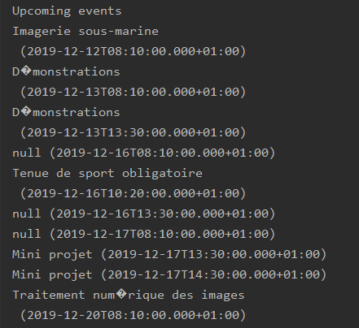

# **Utilisation de Google Calendar**

Google Calendar est un outil qui permet de tenir son emploi du temps jour après jour.

## Pourquoi l'utilisons-nous ?

L'objectif d'utiliser Google Calendar est dans un premier temps de pratiquer l'utilisation d'un API. En effet, Google propose de nombreux API pour nombreuses de leurs applications. C'est le cas pour Google Calendar.

## Qu'allons-nous faire ?

Dans un premier temps, nous voulons afficher les éléments qui sont présents dans notre agenda.

## Qu'avons nous mis en place pour réussir cela ?

D'abord, il faut récupérer et importer les différentes bibliothèques et librairies nécessaires.

```java
import com.google.api.client.auth.oauth2.Credential;
import com.google.api.client.extensions.java6.auth.oauth2.AuthorizationCodeInstalledApp;
import com.google.api.client.extensions.jetty.auth.oauth2.LocalServerReceiver;
import com.google.api.client.googleapis.auth.oauth2.GoogleAuthorizationCodeFlow;
import com.google.api.client.googleapis.auth.oauth2.GoogleClientSecrets;
import com.google.api.client.googleapis.javanet.GoogleNetHttpTransport;
import com.google.api.client.http.javanet.NetHttpTransport;
import com.google.api.client.json.JsonFactory;
import com.google.api.client.json.jackson2.JacksonFactory;
import com.google.api.client.util.DateTime;
import com.google.api.client.util.store.FileDataStoreFactory;
import com.google.api.services.calendar.Calendar;
import com.google.api.services.calendar.CalendarScopes;
import com.google.api.services.calendar.model.Event;
import com.google.api.services.calendar.model.Events;

import java.io.FileNotFoundException;
import java.io.IOException;
import java.io.InputStream;
import java.io.InputStreamReader;
import java.security.GeneralSecurityException;
import java.util.Collections;
import java.util.List;

```

Une fois ceci fait, on peut s'atteler à communiquer avec notre emploi du temps !!!

On va essayer d'afficher dans la console de notre IDE, les prochains cours qui sont programmés !

Pour ce faire, nous devons créer une application et obtenir un id et clé d'authentification qui sera utilisé dans le programme principal.

Ces accès sont stockés dans le fichier creditentials.json.

Le code afin de vérifier si les accès existent est :

```java
    private static Credential getCredentials(final NetHttpTransport HTTP_TRANSPORT) throws IOException {
        // Load client secrets.
        InputStream in = CalendarQuickstart.class.getResourceAsStream(CREDENTIALS_FILE_PATH);
        if (in == null) {
            throw new FileNotFoundException("Resource not found: " + CREDENTIALS_FILE_PATH);
        }
        GoogleClientSecrets clientSecrets = GoogleClientSecrets.load(JSON_FACTORY, new InputStreamReader(in));

        // Build flow and trigger user authorization request
        GoogleAuthorizationCodeFlow flow = new GoogleAuthorizationCodeFlow.Builder(
                HTTP_TRANSPORT, JSON_FACTORY, clientSecrets, SCOPES)
                .setDataStoreFactory(new FileDataStoreFactory(new java.io.File(TOKENS_DIRECTORY_PATH)))
                .setAccessType("offline")
                .build();
        LocalServerReceiver receiver = new LocalServerReceiver.Builder().setPort(8888).build();
        return new AuthorizationCodeInstalledApp(flow, receiver).authorize("user");
    }
```

Ensuite, nous allons devoir récupérer nos données et nos cours exportés depuis Aurion.

Pour cela, on va appeler le Calendrier :

```java
    public static void main(String... args) throws IOException, GeneralSecurityException {
        // Build a new authorized API client service.
        final NetHttpTransport HTTP_TRANSPORT = GoogleNetHttpTransport.newTrustedTransport();
        Calendar service = new Calendar.Builder(HTTP_TRANSPORT, JSON_FACTORY, getCredentials(HTTP_TRANSPORT))
                .setApplicationName(APPLICATION_NAME)
                .build();

        // List the next 10 events from the primary calendar.
        DateTime now = new DateTime(System.currentTimeMillis());
        Events events = service.events().list("primary")
                .setMaxResults(10)
                .setTimeMin(now)
                .setOrderBy("startTime")
                .setSingleEvents(true)
                .execute();
        List<Event> items = events.getItems();

        if (items.isEmpty()) {
            System.out.println("No upcoming events found.");
        } else {
            System.out.println("Upcoming events");
            for (Event event : items) {
                DateTime start = event.getStart().getDateTime();
                if (start == null) {
                    start = event.getStart().getDate();
                }
                System.out.printf("%s (%s)\n", event.getSummary(), start);
            }
        }
    }
```

On affiche le paramètre "primary" car c'est lui qui contient normalement le titre du cours.

Cependant, pour certaines données du calendrier, le programme plante car le summary est vide et ne contient aucune donnée.

Dans le cas où les 10 prochains événements sont correctement remplis au niveau du summary, on obtient l'affichage suivant :



Voilà, maintenant il serait intéressant de repartir de ces données et de les ranger dans un json par exemple. Avec ce format, on pense qu'il serait possible de les exploiter et les utiliser pour faire une interface sous Android Studio.

