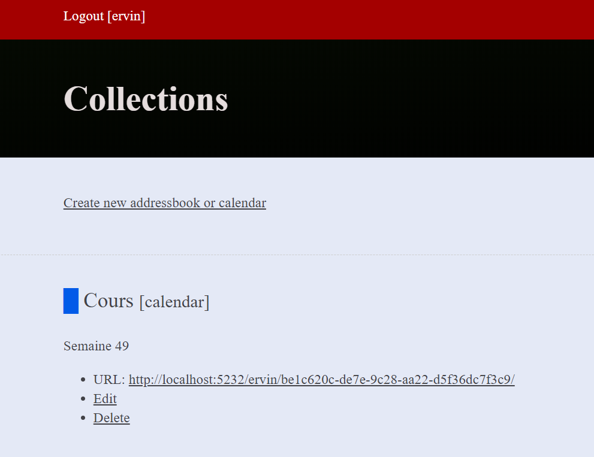
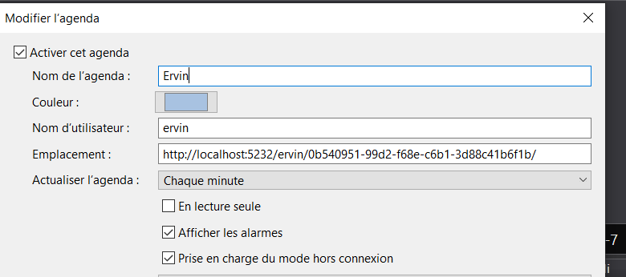
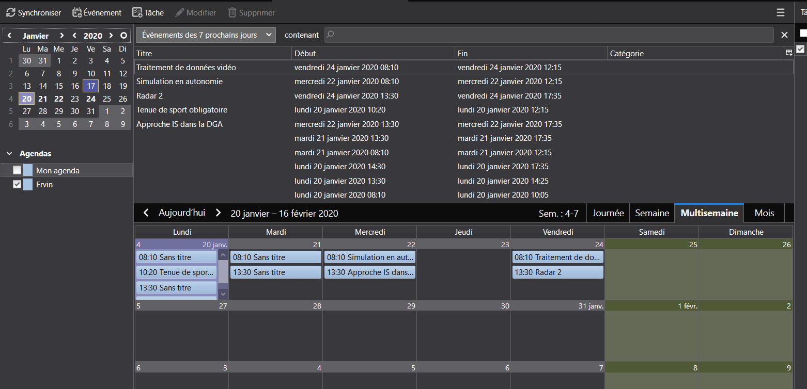
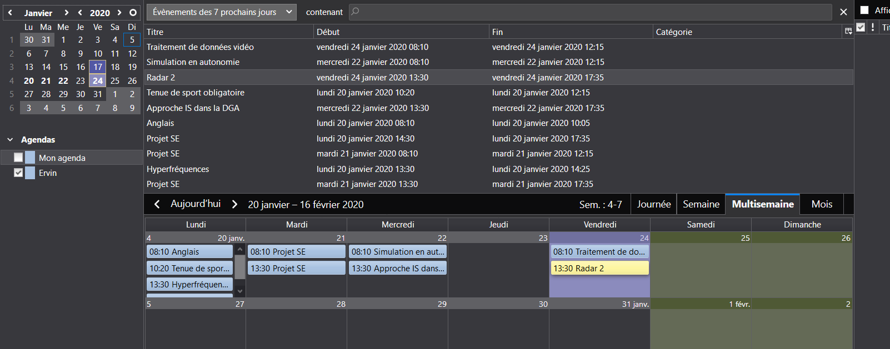

# Un serveur de calendrier

Suite à la première présentation de notre projet le 13/12 dernier, une des propositions faites par le jury pour s'appuyer sur des données "propres" et "stables" était de mettre en place un serveur. Ce serveur permettrait de stocker les données de cours.

### Repérage de serveurs

Avant de choisir un serveur de calendrier en particulier, nous avons regardé les différents options qui existent sur le "marché".

#### 																												Serveur de calendrier

| Modèle                                                    | OS Supporté                      | Compatibilité  Android | Niveau de documentation | Complexité |
| --------------------------------------------------------- | -------------------------------- | ---------------------- | ----------------------- | ---------- |
| Darwin  Calendar Server     (Calendar and Contact Server) | Linux / Win(déconseillé) / MacOS | OK                     | +++                     | +++        |
| Radicale                                                  | Linux / Win / MacOS (à venir)    | OK                     | +++                     | ++         |
| Cosmo                                                     | Windows / Linux                  | OK                     | ++                      | +++        |
| BedeWork                                                  | Windows / Linux                  | OK                     | ++                      | +++        |

### Quel serveur ?

À l'heure actuelle nous avons fait le choix d'utiliser le service Radicale. Il est rapidement utilisable et configurable de manière plutôt rapide.

Il est compatible avec Windows ou Linux et surtout avec Android. Radicale est également très bien documenté sur son site.

### Comment le mettre en place ?

Sous Win10, à travers le PowerShell en administrateur :

1) 

```powershell
python -m pip install --upgrade radicale
```

2)

```
python -m radicale --config '""' --storage-filesystem-folder=~/radicale/collections
```

Ensuite, lorsque que l'on va écouter sur le port 5332 (http://localhost:5232/), voici ce que l'on peut voir :


Pour le moment, il n'y aucune configuration effectué, donc n'importe qui peut se connecter à notre serveur.

Voilà ce qui est possible de faire une fois connecté :



Voilà, j'ai créé un premier calendrier.

Cependant, ce calendrier est vide à l'heure actuelle !

Il va falloir le remplir de données notamment nos données de cours de l'ENSTA. Dans un premier temps, je vais le remplir à l'aide d'un client de messagerie qui est Mozilla Thunderbird. Il est libre et distribué gratuitement par la fondation Mozilla et issu du projet Mozilla. Je verrais dans un second temps pour le faire avec Android Studio.

Voici les paramètres de connexions à mettre sous Thunderbird :



J'ai importé directement un agenda téléchargé depuis Aurion.



Ci-dessus, on voit qu'il nous manque toujours le titre de certains cours (cf. l'étude mené précédemment sur les données provenant d'Aurion). Je vais modifier les titres à la main afin que le fichier présent sur le serveur soit bon.



Le temps est venu de protéger l'accès aux calendriers de notre serveur.

Radicale vient charger un fichier de configuration par défaut qui doit se situer au niveau de etc/radicale.

Ce fichier est la clé de voûte de la gestion du serveur.

À partir de celui-ci on va pouvoir piloter et gérer le serveur.

Tout d'abord, nous allons définir les utilisateurs du serveur.

Pour ce faire, il faut créer un fichier contenant les id et password de ces derniers.

Il faut télécharger la librairie :

```bash
sudo apt-get install apache2-utils
```

Ce paquet permet de piloter et gérer les serveurs web APACHE.

Ensuite on crée notre nouveau fichier users et on crée le premier profil :

```
sudo htpasswd -B -c /etc/radicale/users fakeuser
```

À la suite de cette ligne de commande, on doit donner un mot de passe pour l'utilisateur fakeuser :

```
New password:
Re-type new password:
```

Ensuite, j'ai fait le choix de crypter les mots de passes grâce au package de hachage bcrypt.

